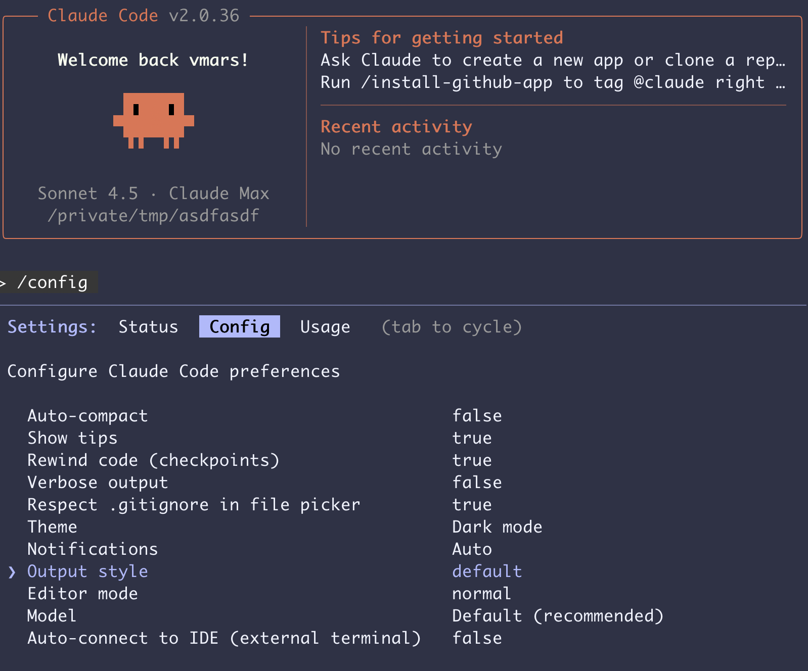

# 🚀 forge-vhdl: AI-Powered VHDL Development

**Build VHDL components in 2-5 minutes with Claude Code.**

[](../../generate)

Progressive testing • Environment auto-detection • 3-agent autonomous workflow • 98% cleaner output

---

## Quick Start

### 1. Clone This Template

```bash
# Click "Use This Template" above, or clone directly:
git clone https://github.com/YOUR-USERNAME/YOUR-REPO-NAME.git
cd YOUR-REPO-NAME
```

### 2. Setup & Launch

```bash
# Install dependencies
uv sync

# Launch Claude Code CLI
claude

# Inside Claude, start the interactive workflow
/forge-start
```

### 3. You Should See This



**You're ready!** Claude will guide you through building your first VHDL component.

---

## What You Get

### ⚡ AI-Assisted Workflows
- **AI-First** (2-5 min) - Pattern recognition + intelligent defaults
- **Engineer** (15-30 min) - Structured 30-question interview
- **Reference specs** - 6 gold-standard examples

### 🧪 Progressive Testing
- **P1 tests:** <20 lines output (98% noise reduction: 287 lines → 8 lines)
- **P2/P3 tests:** Comprehensive validation
- **GHDL filtering:** Token-efficient for LLM iteration

### 🎯 VHDL-2008 Standards
- Verilog-compatible (no enums!)
- Hierarchical reset patterns
- Mandatory port ordering
- Universal signal prefixes

### 📦 Component Library
- Clock dividers, edge detectors, synchronizers
- Voltage packages (3.3V, 5V, ±5V bipolar)
- FSM debugging tools
- LUT utilities, serialization

---

## Example: Build a PWM Generator

```
You: "I need a PWM generator. Use the AI-First workflow."

Claude: What clock frequency? (e.g., 125 MHz)
You: 125 MHz

Claude: [Proposes complete spec]
        ✅ VHDL generated
        ✅ Tests passing (4/4 PASS, <20 lines)

Done! Check workflow/artifacts/
```

**Time:** 2-5 minutes from idea to tested VHDL.

---

## Learn from Examples

**See the `claude` branch** for a complete 3-agent workflow execution:

```bash
git fetch origin claude
git log origin/claude --oneline  # Incremental commits
git diff main...origin/claude    # Generated artifacts
```

---

## Environments

**🌐 Cloud (Codespaces/Web)** - Zero setup, GHDL auto-installed
**💻 Local (CLI)** - Interactive, full control (requires [GHDL](https://github.com/ghdl/ghdl))

Both automatically detected! Just run `uv run python .claude/env_detect.py`

---

## Documentation

**Start here:**
- `CLAUDE.md` - Complete development guide
- `llms.txt` - Component catalog
- `.claude/CLAUDE_LOCAL.md` - Local CLI guide
- `.claude/CLAUDE_CLOUD.md` - Cloud guide

**Workflows:**
- `workflow/AI_FIRST_REQUIREMENTS.md` - Fast requirements
- `workflow/ENGINEER_REQUIREMENTS.md` - Detailed requirements
- `workflow/specs/reference/` - Example specifications

**Technical:**
- `docs/VHDL_CODING_STANDARDS.md` - Style guide
- `docs/PROGRESSIVE_TESTING_GUIDE.md` - Test patterns
- `docs/COCOTB_TROUBLESHOOTING.md` - Debugging

---

## Development History

Full development history preserved in `development_archive_3v3_dont_delete_me` branch.

---

## License

MIT License - See `LICENSE` file

---

**Version:** 3.2.0 (template-ready)
**Original Template:** https://github.com/vmars-20/forge-vhdl-3v3-vmars
**Maintainer:** Moku Instrument Forge Team

🤖 Template prepared with [Claude Code](https://claude.com/claude-code)
